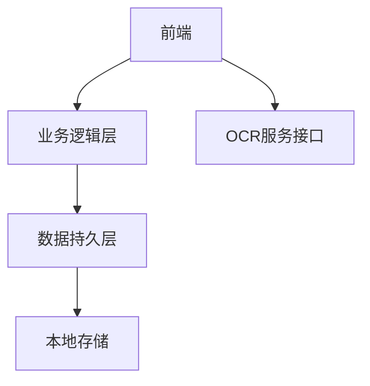

# 记账App架构设计 (v1.0)

## 技术栈
- **前端**：React Native 0.73
- **UI组件库**：React Native Paper 5.x
- **状态管理**：Zustand 4.x
- **本地数据库**：WatermelonDB
- **导航系统**：React Navigation 7.x

## 核心架构


## 模块设计

### 1. 数据模块
- **数据库模型**：
```javascript
// Transaction 模型
export class Transaction extends Model {
  @field('amount') amount
  @field('type') type // income/expense
  @field('category') category
  @field('date') date
  @field('memo') memo
  @field('image_uri') imageUri
}
```

### 2. OCR处理流程
1. 图片预处理（压缩/旋转）
2. Base64编码
3. API请求封装
4. 响应处理：
   - 成功：自动记账
   - 失败：错误提示

### 3. 性能优化
- 虚拟列表渲染
- 数据库索引
- 图片懒加载

## 接口规范
### OCR识别接口
- 端点：`POST /api/v1/receipt/parse`
- 请求格式：
```json
{
  "image": "base64_string",
  "device_id": "string"
}
```
- 响应格式：
```json
{
  "transactions": [
    {
      "amount": 38.5,
      "type": "expense",
      "category": "餐饮",
      "date": "2025-07-06"
    }
  ]
}
```

## 扩展性设计
- 插件式架构设计
- 配置驱动UI
- 多主题支持
