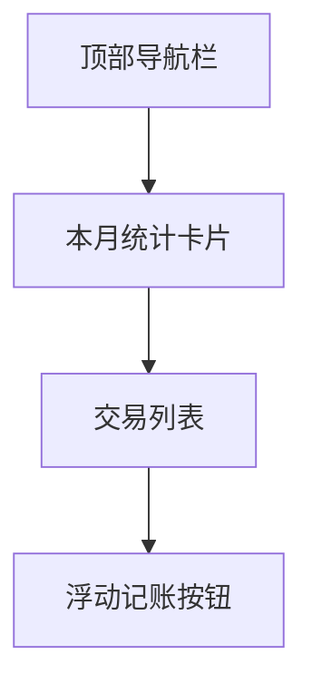
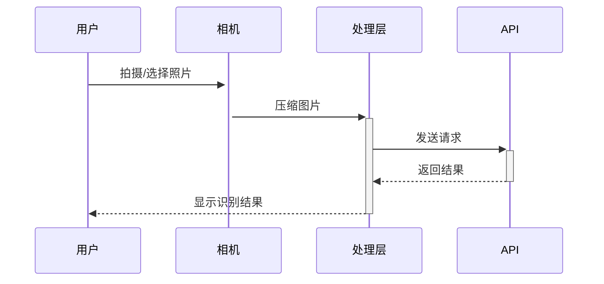

# 记账App UI设计文档 (v1.0)

## 设计规范
- **设计系统**: Material Design 3
- **颜色方案**:
  - 主色: #6200EE (紫色)
  - 辅助色: #03DAC6 (青色)
  - 错误色: #B00020 (红色)
- **字体**: 
  - 主要字体: Roboto (Android), San Francisco (iOS)
  - 字号规范: 标题24px, 正文16px, 小字12px

## 核心页面设计

### 1. 首页 (交易列表)


### 2. 记账页面
```javascript
// 表单组件结构
<ScrollView>
  <AmountInput />
  <TypeSelector />
  <CategoryPicker />
  <DatePicker />
  <MemoInput />
  <ReceiptUpload />
  <SubmitButton />
</ScrollView>
```

### 3. 统计页面
- 图表类型:
  - 环形图 (分类占比)
  - 柱状图 (时间趋势)
  - 数据筛选控件

## 组件库应用
### React Native Paper组件映射
| 功能 | 组件 | 自定义样式 |
|------|------|------------|
| 按钮 | Button | 圆角8px, 高度48px |
| 输入框 | TextInput | 下划线样式 |
| 卡片 | Card | 阴影效果 |
| 对话框 | Modal | 半透明背景 |

## 交互设计
1. **OCR识别流程**:


2. **表单验证**:
- 实时验证金额格式
- 必填项红点提示
- 提交前综合校验

## 主题与暗黑模式
```typescript
// 主题配置示例
const lightTheme = {
  colors: {
    primary: '#6200EE',
    background: '#FFFFFF',
    text: '#000000'
  }
}

const darkTheme = {
  colors: {
    primary: '#BB86FC', 
    background: '#121212',
    text: '#FFFFFF'
  }
}
